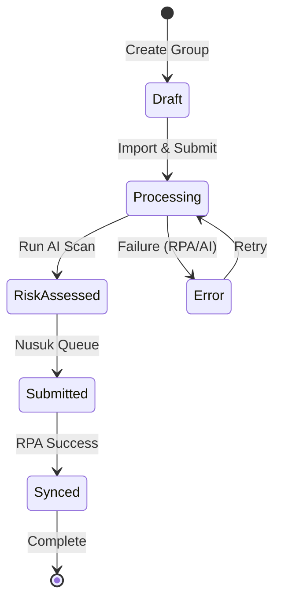

# Core User Workflow

<!-- used: algorithmic core user workflow -->

## Success Pathway: From Arrival to NUSUK Submission

```pseudo
ALGORITHM CoreWorkflow:
  1. ARRIVE at Landing -> (Landing, 100%)
  2. ENTER Dashboard -> (Dashboard, 87%, gap:5)
  3. CREATE Group -> (groups-crud, 100%)
  4. IMPORT Travelers (CSV) -> (travelers-crud, 87%, gap:5)
  5. RUN Risk Assessment (AI) -> (risk-scan, 87%, gap:5)
  6. SUBMIT TO NUSUK (Queue Job) -> (nusuk-rpa, 62%, gap:5,7,8)
  7. MONITOR Sync Status -> (jobs-queue, 87%, gap:5)
  8. NOTIFY Group Leader (WhatsApp) -> (message-wa, 37%, gap:1,4,5,6,7)
  9. SUCCESS: All travelers "Accepted" or "Ready"
```

### State Machine (Pseudo-Code)



### Critical Error Paths & Remediation

1. **CSV Parsing Failure**:
   - *Risk*: Invalid date formats block import.
   - *Remediation*: CsvUploader has fallback transformers; manual fix required if transform fails.
2. **AI Service Downtime**:
   - *Risk*: Risk scores unavailable.
   - *Remediation*: `aiService.ts` automatically falls back to deterministic mock scoring.
3. **RPA Blockage**:
   - *Risk*: NUSUK portal changes selectors.
   - *Remediation*: `nusuk_rpa_local.ts` requires manual selector update; job marked as "Failed".
